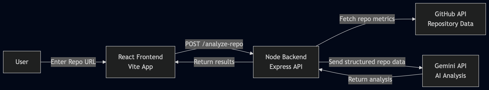

# Git-Pulse Frontend

React + Vite + Tailwind UI for the Git-Pulse dashboard.

## Run

```bash
npm install
npm run dev
```

## Backend Hook

Set optional API base URL:

```bash
VITE_API_BASE_URL=http://localhost:5000
```

The app sends:

- `POST /api/analyze`
- Body: `{ "repo": "owner/repo" }`

Expected response shape:

```json
{
  "repository": "owner/repo",
  "analyzedAt": "2026-03-02T15:00:00.000Z",
  "inputStats": {
    "readmeChars": 2048,
    "issueSnippets": 10
  },
  "analysis": {
    "stars": 123,
    "forks": 45,
    "openIssues": 6,
    "vibe": {
      "score": 70,
      "note": "string"
    },
    "clarity": {
      "score": 55,
      "verdict": "under-documented",
      "note": "string"
    },
    "fires": ["string", "string", "string"]
  }
}
```

## Architecture Diagram



## How It Works

1. User enters a GitHub repository URL
2. The frontend sends the repo to the backend API
3. The backend fetches repository metadata from the GitHub API
4. Structured repository data is sent to the Gemini API
5. Gemini generates insights about repository health and sustainability
6. Results are returned to the frontend and displayed to the user

---

## Tech Stack

Frontend:
- React
- Vite

Backend:
- Node.js
- Express

APIs:
- GitHub REST API
- Google Gemini API

---